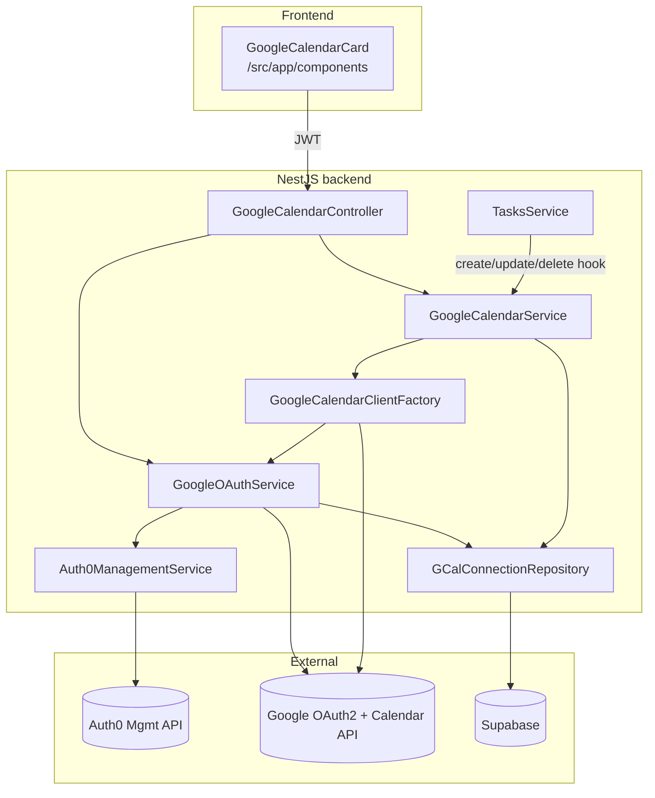

# Google Calendar Integration

Syncs Origin tasks that have a due date to each user's Google Calendar.

## 1. Architecture

Two authentication paths. Backend always tries Auth0 federation first and falls
back to a standalone OAuth connection stored in Supabase.



### Path A — Auth0 federated (preferred, zero-click)

1. User signs in through Auth0 with "Continue with Google" and approves the
   `calendar.events` scope.
2. Auth0 stores the Google refresh token on the user's identity.
3. Backend calls `GET https://{AUTH0_DOMAIN}/api/v2/users/{id}` with an M2M
   token, extracts `identities[*].refresh_token`.
4. Backend exchanges that refresh token at
   `https://oauth2.googleapis.com/token` for a short-lived access token.

### Path B — Standalone OAuth (fallback)

For users who signed up via email/password. Triggered by clicking
**Connect Google Calendar** in Settings → Integrations.

1. `POST /api/integrations/google/oauth/start` returns a Google consent URL
   with a signed `state` JWT that encodes the Auth0 `sub`.
2. Google redirects to `/api/integrations/google/oauth/callback`.
3. Backend exchanges `code` → `{access_token, refresh_token}`, encrypts both
   with AES-256-GCM, and stores them in `google_calendar_connections`.

## 2. Endpoints

All routes except `/oauth/callback` require the Auth0 JWT Bearer header.
Request/response bodies are JSON unless noted.

| Method | Path | Auth | Body | Response |
|-------|------|------|------|----------|
| POST | `/api/integrations/google/oauth/start` | JWT | – | `{ url: string }` |
| GET  | `/api/integrations/google/oauth/callback` | state JWT | `?code&state` | 302 → `${FRONTEND_URL}/settings?google=...` |
| GET  | `/api/integrations/google/status` | JWT | – | `{ connected, source?, googleEmail?, calendarId?, needsReconnect? }` |
| POST | `/api/integrations/google/disconnect` | JWT | – | 204 |
| GET  | `/api/integrations/google/calendars` | JWT | – | `CalendarListItem[]` |
| PATCH | `/api/integrations/google/settings` | JWT | `{ calendarId }` | `{ ok: true }` |
| POST | `/api/integrations/google/sync/task/:taskId` | JWT | – | `SyncTaskResponse` |
| DELETE | `/api/integrations/google/sync/task/:taskId` | JWT | – | `SyncTaskResponse` |
| POST | `/api/integrations/google/sync/backfill` | JWT | – | `BackfillResponse` (rate-limited 1/5min per user) |

## 3. Environment variables

| Var | Used in | Purpose |
|-----|---------|---------|
| `BACKEND_URL` | OAuth redirect links | Public base URL of the NestJS server |
| `GOOGLE_OAUTH_CLIENT_ID` | `GoogleOAuthService` | Web OAuth 2.0 client |
| `GOOGLE_OAUTH_CLIENT_SECRET` | `GoogleOAuthService` | Web OAuth 2.0 client |
| `GOOGLE_OAUTH_REDIRECT_URI` | `GoogleOAuthService` | Must match the one registered in GCP Console |
| `GOOGLE_CALENDAR_DEFAULT_ID` | `GoogleCalendarService` | Default calendar for new connections (`primary`) |
| `GCAL_TOKEN_ENC_KEY` | `TokenCryptoService` | 32-byte base64 AES-GCM key |
| `GCAL_OAUTH_STATE_SECRET` | `GoogleOAuthService` | HS256 secret for the `state` JWT |
| `AUTH0_MGMT_CLIENT_ID` | `Auth0ManagementService` | M2M app (optional — enables federated path) |
| `AUTH0_MGMT_CLIENT_SECRET` | `Auth0ManagementService` | M2M app |
| `AUTH0_MGMT_AUDIENCE` | `Auth0ManagementService` | Defaults to `https://{AUTH0_DOMAIN}/api/v2/` |

Generate the two secrets with:
```bash
node -e "console.log(require('crypto').randomBytes(32).toString('base64'))"
```

## 4. Setup runbook

### GCP Console
1. `console.cloud.google.com` → pick project `electric-rhino-493918-t6`.
2. **APIs & Services → Library** → enable **Google Calendar API**.
3. **APIs & Services → OAuth consent screen** → External (or Internal for a
   Workspace). Add scopes: `.../auth/calendar.events`, `openid`, `email`,
   `profile`. Add test users while unverified.
4. **Credentials → Create Credentials → OAuth client ID → Web application**.
   - Authorized JavaScript origins: `http://localhost:3000`, `http://localhost:5173`
   - Authorized redirect URIs: `http://localhost:3000/api/integrations/google/oauth/callback`
   - Save the Client ID + Secret into `server/.env`.

### Auth0 Dashboard
1. **Connections → Social → Google** — enable; under **Permissions**, tick
   `calendar.events` (or add the full scope URL) alongside `email`, `profile`,
   `openid`. Toggle "Sync user profile attributes at each login" **ON**.
2. **Applications → APIs → Auth0 Management API → Machine to Machine
   Applications** — authorize a new M2M app with scopes `read:users` and
   `read:user_idp_tokens`. Copy Client ID + Secret into `server/.env`.
3. Existing Google-login users must re-auth once to grant `calendar.events`.

### Supabase
Run the migration:
```bash
# via supabase CLI, or paste supabase/migrations/create_google_calendar_integration.sql
# into the SQL editor.
```

### Backend
```bash
cd server
npm install            # picks up googleapis + google-auth-library + jsonwebtoken
npm run dev
```

## 5. Sync rules (TasksService)

| Task change | Behaviour |
|-------------|-----------|
| `create` with `due_date` | Insert event, save mapping |
| `create` without `due_date` | No-op |
| `update` due_date changed / title / description | `events.patch` existing event, or insert if missing (404 handling) |
| `update` `due_date` cleared | Delete event + mapping |
| `update` `status` → `Done` | Delete event + mapping |
| `delete` task | Delete event + mapping |

All hooks are fire-and-forget — calendar failures never block the task write.

## 6. Troubleshooting

| Symptom | Cause / fix |
|---------|-------------|
| `invalid_grant` on refresh | User revoked at myaccount.google.com, or refresh token expired (7-day limit on unverified app). Row is auto-marked `needs_reconnect`. User clicks Reconnect. |
| `scope not granted` | Re-auth user; verify `calendar.events` is listed on the Auth0 Google connection. |
| 403 on `events.insert` | User selected a read-only calendar. Use the calendar picker to switch. |
| `redirect_uri_mismatch` | URI in GCP Console must match `GOOGLE_OAUTH_REDIRECT_URI` exactly (scheme, port, trailing slash). |
| Federated path silently skipped | Auth0 M2M creds missing, or Google identity has no `refresh_token` (Auth0 connection was created without offline access). |
| Token encryption error on startup | `GCAL_TOKEN_ENC_KEY` is not a 32-byte base64 string. |

## 7. Manual test checklist

- [ ] Connect via OAuth (standalone path)
- [ ] Connect via Auth0 Google login (federated path)
- [ ] Create task with due date → event appears in Google
- [ ] Edit task title → event summary updates
- [ ] Clear due date → event removed
- [ ] Mark task `Done` → event removed
- [ ] Delete task → event removed
- [ ] Change target calendar → next sync writes to the new calendar
- [ ] Backfill creates events for existing tasks; respects 5-min rate limit
- [ ] Disconnect revokes token and clears mappings
